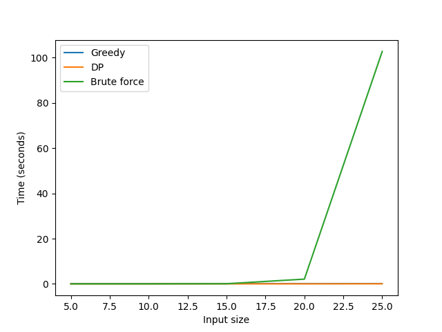
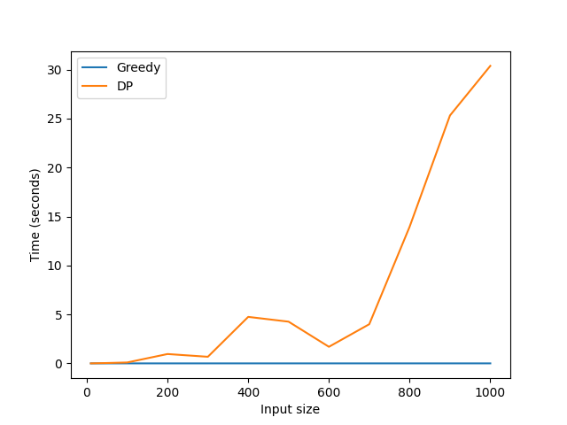

# Cooper Riley - Final Project - Problem statement 1


This project was split up into seperate files:

- brute.py has the brute force implementation.
- dp.py has the dynamic programming implementation.
- greedy.py has the greedy implementation.
- script.py is used to run all functions and time them, then output them to a CSV file.
- graph.py is used to make the graphs shown below.
- output.csv contains results from running all 3 implementation.
- DPvsGreedy.csv contains results from running DP and greedy implentations on larger input sizes to get a closer look at runtime comparison.
- result.txt shows the results of the algorithms run 2 times on input sizes 5, 10, 15, 20, 25.
- Project Proposal.pdf is my project proposal docuemnt with changes to the pusedo code.


## Runtimes
- Greedy: O(n log n) because it sorts the inputs based on a certain criteria. This is nlogn time.
- Dynamic Programming: O(n) - becasue it only iterates over the input 1 time.
- Brute Force: O(2^n) - becasue it creates all possible subsets of proposals which is 2^n time. 

## Example Output
    -----------------------
    Index, Quality, Funding, budget = 101, n = 5
    Proposals:
    0, 3, 29
    1, 52, 58
    2, 40, 27
    3, 8, 47
    4, 44, 33
    Greedy - Total Funding used: 89, Total Quality: 87, Subset: [0, 2, 4]
    DP - Total Funding used: 91, Total Quality: 96, Subset: [1, 4]
    Brute - Total Funding used: 91, Total Quality: 96, Subset: [1, 4]
    Times (n, greedy, dp, brute):
    5,1.1000000000004062e-05,0.00023230000000000472, 4.563800000000062e-05
    -----------------------
    Index, Quality, Funding, budget = 376, n = 10
    Proposals:
    0, 47, 50
    1, 95, 53
    2, 54, 47
    3, 28, 33
    4, 94, 1
    5, 36, 21
    6, 12, 44
    7, 67, 93
    8, 7, 88
    9, 47, 46
    Greedy - Total Funding used: 344, Total Quality: 468, Subset: [0, 1, 2, 3, 4, 5, 7, 9]
    DP - Total Funding used: 344, Total Quality: 468, Subset: [0, 1, 2, 3, 4, 5, 7, 9]
    Brute - Total Funding used: 344, Total Quality: 468, Subset: [0, 1, 2, 3, 4, 5, 7, 9]
    Times (n, greedy, dp, brute):
    10,1.0273999999997618e-05,0.0020959810000000037, 0.0014111039999999964
    -----------------------
    Index, Quality, Funding, budget = 80, n = 15
    Proposals:
    0, 79, 67
    1, 20, 98
    2, 73, 86
    3, 39, 43
    4, 89, 71
    5, 26, 80
    6, 79, 90
    7, 7, 51
    8, 87, 67
    9, 44, 15
    10, 40, 3
    11, 20, 99
    12, 53, 6
    13, 45, 49
    14, 35, 11
    Greedy - Total Funding used: 78, Total Quality: 211, Subset: [3, 9, 10, 12, 14]
    DP - Total Funding used: 78, Total Quality: 211, Subset: [3, 9, 10, 12, 14]
    Brute - Total Funding used: 78, Total Quality: 211, Subset: [3, 9, 10, 12, 14]
    Times (n, greedy, dp, brute):
    15,9.88700000000009e-06,0.0004058540000000041, 0.057591593999999996
    -----------------------
    Index, Quality, Funding, budget = 129, n = 20
    Proposals:
    0, 24, 70
    1, 61, 32
    2, 69, 98
    3, 28, 24
    4, 71, 87
    5, 75, 40
    6, 46, 70
    7, 67, 71
    8, 35, 96
    9, 34, 6
    10, 9, 51
    11, 36, 100
    12, 85, 53
    13, 66, 66
    14, 99, 14
    15, 6, 86
    16, 61, 33
    17, 9, 56
    18, 46, 93
    19, 4, 56
    Greedy - Total Funding used: 125, Total Quality: 330, Subset: [1, 5, 9, 14, 16]
    DP - Total Funding used: 125, Total Quality: 330, Subset: [1, 5, 9, 14, 16]
    Brute - Total Funding used: 125, Total Quality: 330, Subset: [1, 5, 9, 14, 16]
    Times (n, greedy, dp, brute):
    20,1.2257000000015505e-05,0.000923604999999994, 2.518691011
    -----------------------
    Index, Quality, Funding, budget = 71, n = 25
    Proposals:
    0, 88, 51
    1, 35, 29
    2, 34, 87
    3, 29, 63
    4, 45, 63
    5, 79, 82
    6, 78, 72
    7, 81, 40
    8, 62, 65
    9, 45, 24
    10, 21, 67
    11, 85, 88
    12, 83, 53
    13, 32, 57
    14, 85, 62
    15, 23, 18
    16, 13, 78
    17, 49, 85
    18, 81, 23
    19, 93, 84
    20, 2, 28
    21, 20, 25
    22, 16, 98
    23, 5, 35
    24, 6, 67
    Greedy - Total Funding used: 63, Total Quality: 162, Subset: [7, 18]
    DP - Total Funding used: 63, Total Quality: 162, Subset: [7, 18]
    Brute - Total Funding used: 63, Total Quality: 162, Subset: [7, 18]
    Times (n, greedy, dp, brute):
    25,1.3043000000045879e-05,0.00047216599999977404, 96.14480941600002

## Test cases
I used random test cases of verious lengths to test the algorithms. In order to check the correctness of the DP and greedy algorithm I could compare it to the brute force as it is garunteed the correct answer if given enough time to run. 

I only ran all 3 algorithms on smaller imput sizes up to 25 because anything higher brute force would exceed 3 minute runtimes and cause segmentation faults due to no more memory left on my computer. 

I proceeded to run DP vs greedy on larger input sizes [10, 50, 100, 200, 300, 400, 500, 600, 700, 800, 900, 1000] in order to see how they compare on the largest input sizes

It was found that the greedy implementation outperformed the dynamic programming implementation on all input sizes, but was not always garunteed the correct output.

## Runtime Graphs




## Why Greedy Does Not Always Give Correct Output
Since my greedy implementation used the ratio of quality/cost in order to sort the proposals, it can sometimes lead to a non-optimal answer. We can see this happen on this test case:
```
-----------------------
Index, Quality, Funding, budget = 101, n = 5
0, 3, 29
1, 52, 58
2, 40, 27
3, 8, 47
4, 44, 33
Greedy - Total Funding used: 89, Total Quality: 87, Subset: [0, 2, 4]
DP - Total Funding used: 91, Total Quality: 96, Subset: [1, 4]
Brute - Total Funding used: 91, Total Quality: 96, Subset: [1, 4]
```

This shows a moment when the greedy algorithm can sometimes get a non-optimal soltuon. This is because it sorts based on quality/cost ratio, making it select the proposals that are the most "worth it" but since it is greedy it will always select a proposal if it fits. If it does not fit then it doesnt chose it, but sometimes selecting the first proposals might not be the optimal subset. This means that the algorithm may choose a proposal with a high quality-to-funding ratio at one step, even if choosing a proposal with a lower quality-to-funding ratio at that step would lead to a better overall solution.

## Recomendation
I would choose the greedy algorithm because it returns the correct answer for almost all test cases while also having the second fastest theoretical runtime of the three. For guaranteed results, I would use the dynamic programming approach to get the correct optimal solution. Although it has the fastest theoretical runtime, the experimental runtime did not match up. This is most likely due to my computer. I would not recommend the brute force because it takes a very long time on large input sizes.
